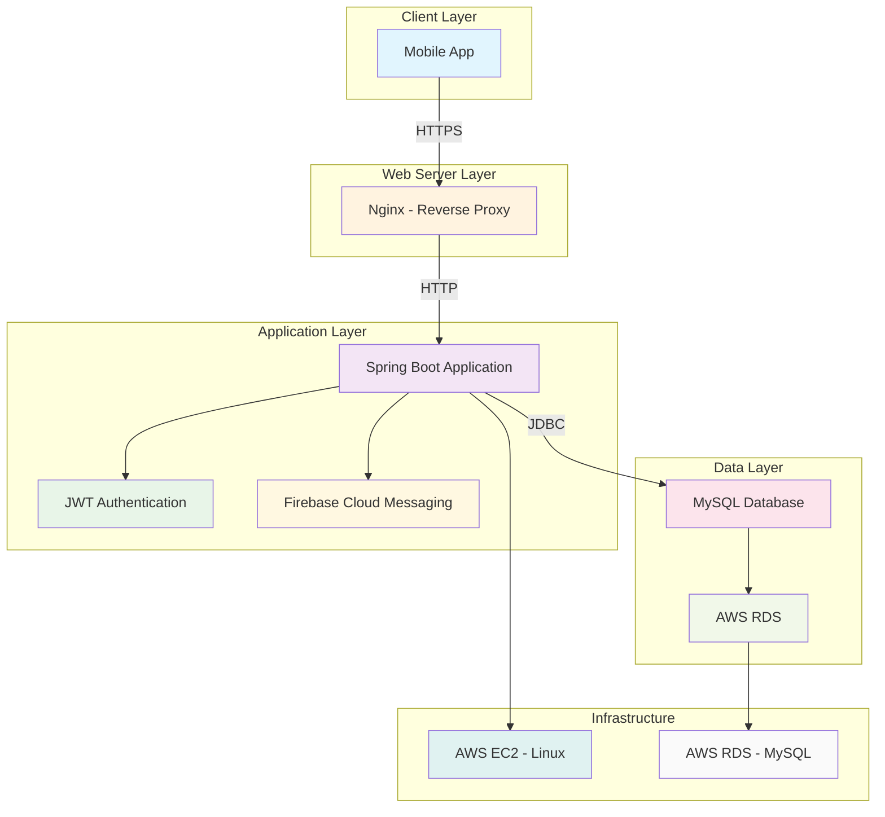
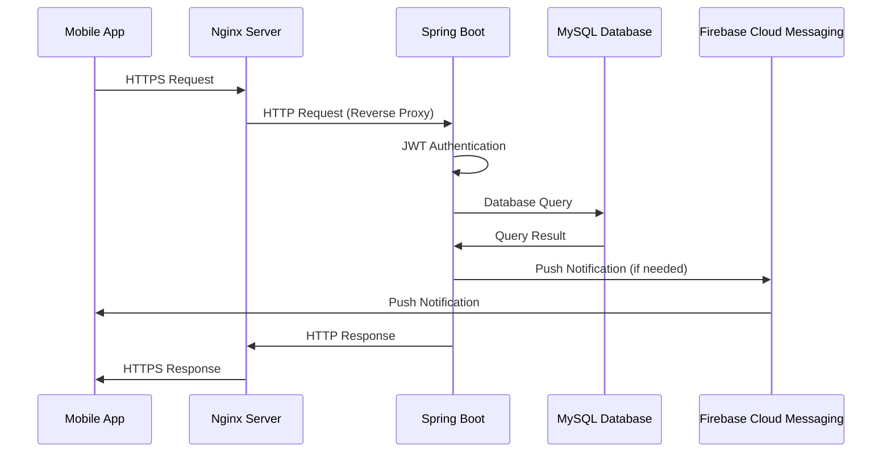

# ? Hodl_Server - 약물 관리 및 건강 기록 백엔드 서버

## ? 프로젝트 개요

**Hodl_Server**는 사용자의 약물 복용 관리와 건강 기록을 위한 모바일 앱의 백엔드 서버입니다. 사용자가 약물을 등록하고 복용 일정을 관리하며, 수면, 운동, 햇빛 노출, 증상 등의 건강 데이터를 기록할 수 있는 RESTful API를 제공합니다.

### ? 주요 기능
- **약물 관리**: 약물 등록, 복용 일정 관리, 복용 기록
- **건강 기록**: 수면, 운동, 햇빛 노출, 증상 기록
- **알림 시스템**: Firebase Cloud Messaging을 통한 푸시 알림
- **사용자 관리**: 회원가입, 로그인, 프로필 관리
- **채팅 기반 UX**: 단계별 채팅 인터페이스를 통한 직관적인 약물 등록

## ?? 시스템 아키텍처

### 전체 시스템 구조



### ? 요청 처리 흐름



### ? 시스템 아키텍처 상세 설명

| 레이어 | 구성 요소 | 역할 | 기술 스택 |
|--------|-----------|------|-----------|
| **Client Layer** | Mobile App | 사용자 인터페이스 | React Native / Flutter |
| **Web Server Layer** | Nginx | 리버스 프록시, 로드 밸런서 | Nginx |
| **Application Layer** | Spring Boot | 비즈니스 로직 처리 | Spring Boot 2.4.2 |
| **Application Layer** | JWT Authentication | 인증 및 권한 관리 | JWT |
| **Application Layer** | Firebase Cloud Messaging | 푸시 알림 서비스 | Firebase FCM |
| **Data Layer** | MySQL Database | 데이터 저장 및 관리 | MySQL 8.0 |
| **Infrastructure** | AWS EC2 | 애플리케이션 서버 | Amazon EC2 (Linux) |
| **Infrastructure** | AWS RDS | 데이터베이스 서버 | Amazon RDS (MySQL) |

## ?? 기술 스택

### Backend
- **Framework**: Spring Boot 2.4.2
- **Language**: Java 8
- **Build Tool**: Gradle
- **Database**: MySQL 8.0
- **ORM**: Spring JDBC Template
- **Authentication**: JWT (JSON Web Token)
- **Push Notification**: Firebase Cloud Messaging
- **Email Service**: JavaMail API
- **Security**: Spring Security (기본 설정)

### Infrastructure
- **Cloud Platform**: AWS
- **Server**: EC2 (Linux)
- **Web Server**: Nginx
- **Database**: RDS (MySQL)
- **Load Balancer**: Nginx (Reverse Proxy)

### Development Tools
- **IDE**: IntelliJ IDEA
- **Version Control**: Git
- **API Testing**: Postman
- **Database Management**: MySQL Workbench

## ? 프로젝트 구조

```
Hodl_Server/
├── src/
│   ├── main/
│   │   ├── java/shop/hodl/kkonggi/
│   │   │   ├── config/                 # 설정 클래스
│   │   │   │   ├── BaseException.java
│   │   │   │   ├── BaseResponse.java
│   │   │   │   ├── BaseResponseStatus.java
│   │   │   │   └── Constant.java
│   │   │   ├── src/
│   │   │   │   ├── user/               # 사용자 관리
│   │   │   │   │   ├── UserController.java
│   │   │   │   │   ├── UserService.java
│   │   │   │   │   ├── UserProvider.java
│   │   │   │   │   ├── UserDao.java
│   │   │   │   │   └── model/
│   │   │   │   ├── medicine/           # 약물 관리
│   │   │   │   │   ├── MedicineController.java
│   │   │   │   │   ├── MedicineService.java
│   │   │   │   │   ├── MedicineProvider.java
│   │   │   │   │   ├── MedicineDao.java
│   │   │   │   │   └── model/
│   │   │   │   ├── record/             # 건강 기록
│   │   │   │   │   ├── medicine/       # 약물 복용 기록
│   │   │   │   │   ├── sleep/          # 수면 기록
│   │   │   │   │   ├── exercise/       # 운동 기록
│   │   │   │   │   ├── sun/            # 햇빛 기록
│   │   │   │   │   └── symptom/        # 증상 기록
│   │   │   │   ├── notification/       # 알림 관리
│   │   │   │   ├── push/               # 푸시 알림
│   │   │   │   ├── email/              # 이메일 서비스
│   │   │   │   ├── firebase/           # Firebase 연동
│   │   │   │   ├── data/               # 공지사항, 버전 관리
│   │   │   │   └── store/              # 스토어 정보
│   │   │   ├── utils/                  # 유틸리티 클래스
│   │   │   │   ├── JwtService.java
│   │   │   │   ├── AES128.java
│   │   │   │   └── ValidationRegex.java
│   │   │   └── WebSecurityConfig.java  # 보안 설정
│   │   └── resources/
│   │       ├── templates/
│   │       │   └── mail.html           # 이메일 템플릿
│   │       └── logback-spring.xml      # 로그 설정
│   └── test/                           # 테스트 코드
├── build.gradle                        # Gradle 설정
├── gradlew
└── README.md
```

## ? 주요 기능 상세 설명

### 1. 사용자 관리 (User Management)

#### 회원가입 및 로그인
- **이메일 인증**: 회원가입 시 이메일 인증 코드 발송
- **JWT 토큰**: 로그인 성공 시 1년 유효한 JWT 토큰 발급
- **비밀번호 암호화**: AES128 알고리즘으로 비밀번호 암호화

#### 프로필 관리
- 닉네임, 생년월일, 성별 정보 관리
- 채팅 기반 닉네임 설정 프로세스

**API 엔드포인트:**
```
POST /app/v1/users          # 회원가입
POST /app/v1/users/logIn    # 로그인
GET  /app/v1/users/{userIdx} # 프로필 조회
PATCH /app/v1/users/{userIdx} # 프로필 수정
```

### 2. 약물 관리 (Medicine Management)

#### 약물 등록 프로세스
채팅 기반의 단계별 약물 등록 시스템:
1. **약물명 입력** → 2. **복용 주기 설정** → 3. **시작일 설정** → 4. **종료일 설정** → 5. **복용 시간 설정**

#### 복용 일정 관리
- 요일별 복용 설정 (월~일)
- 시간대별 복용 설정 (새벽, 아침, 점심, 저녁, 자기전)
- 복용량 및 메모 관리

**API 엔드포인트:**
```
GET  /app/v1/users/medicine/input    # 약물 등록 시작
GET  /app/v1/users/medicine/name     # 약물명 입력
GET  /app/v1/users/medicine/cycle    # 복용 주기 설정
GET  /app/v1/users/medicine/start    # 시작일 설정
GET  /app/v1/users/medicine/end      # 종료일 설정
GET  /app/v1/users/medicine/time     # 복용 시간 설정
POST /app/v1/users/medicine          # 약물 등록
GET  /app/v1/users/medicine          # 약물 목록 조회
PUT  /app/v1/users/medicine/{medicineIdx} # 약물 수정
DELETE /app/v1/users/medicine/{medicineIdx} # 약물 삭제
```

### 3. 건강 기록 (Health Records)

#### 약물 복용 기록
- 일별, 시간대별 복용 여부 기록
- 복용량, 복용 시간, 메모 관리
- 전체 약물 일괄 복용 기록 기능

#### 수면 기록
- 수면 시간, 기상 시간 기록
- 수면 품질 및 수면 관련 메모
- 수면 패턴 분석

#### 운동 기록
- 운동 시작 시간, 총 운동 시간
- 운동 강도 및 운동 종류
- 운동 관련 메모

#### 햇빛 노출 기록
- 야외 활동 시작 시간, 총 활동 시간
- 햇빛 노출 관련 메모

#### 증상 기록
- 체계적인 증상 체크리스트
- 부작용 및 증상 기록
- 증상 그룹별 분류

**API 엔드포인트:**
```
# 약물 복용 기록
GET  /app/v1/users/record/medicine
POST /app/v1/users/record/medicine/all
PATCH /app/v1/users/record/medicine/all

# 수면 기록
GET  /app/v1/users/record/sleep
POST /app/v1/users/record/sleep
PATCH /app/v1/users/record/sleep

# 운동 기록
GET  /app/v1/users/record/exercise
POST /app/v1/users/record/exercise
PATCH /app/v1/users/record/exercise

# 햇빛 기록
GET  /app/v1/users/record/sun
POST /app/v1/users/record/sun
PATCH /app/v1/users/record/sun

# 증상 기록
GET  /app/v1/users/record/symptom
POST /app/v1/users/record/symptom
PATCH /app/v1/users/record/symptom
```

### 4. 알림 시스템 (Notification System)

#### 푸시 알림
- **Firebase Cloud Messaging** 연동
- 약물 복용 시간 알림
- 스케줄링 기반 자동 알림 전송
- 사용자별 알림 설정 관리

#### 알림 설정
- 서비스 알림, 약물 알림, 이벤트 알림, 마케팅 알림 분리
- 시간대별 약물 알림 설정
- 디바이스 토큰 관리

**API 엔드포인트:**
```
GET  /app/v1/users/notification          # 알림 설정 조회
PATCH /app/v1/users/notification         # 알림 설정 수정
GET  /app/v1/users/notification/medicine # 약물 알림 설정 조회
PATCH /app/v1/users/notification/medicine # 약물 알림 설정 수정
PATCH /app/v1/users/notification/token   # 디바이스 토큰 업데이트
```

### 5. 데이터 관리 (Data Management)

#### 공지사항
- 앱 내 공지사항 관리
- 공지사항 목록 및 상세 내용 조회

#### 버전 관리
- 앱 버전 정보 관리
- 최신 버전 정보 조회

**API 엔드포인트:**
```
GET /app/v1/data/noticeboard           # 공지사항 목록
GET /app/v1/data/noticeboard/{idx}     # 공지사항 상세
GET /app/v1/data/version               # 앱 버전 정보
```

## ? 보안 및 인증

### JWT 기반 인증
- **토큰 생성**: 로그인 시 userIdx를 포함한 JWT 토큰 생성
- **토큰 검증**: 각 API 요청 시 X-ACCESS-TOKEN 헤더에서 JWT 추출 및 검증
- **토큰 만료**: 1년 유효한 토큰 (개선 필요: 30분-1시간 권장)

### Spring Security
- 기본적인 Spring Security 설정
- CSRF 보호 비활성화
- 수동 JWT 인증 구현

### 비밀번호 암호화
- AES128 알고리즘을 사용한 비밀번호 암호화
- 이메일 인증 코드 암호화

## ? 데이터베이스 설계

### 주요 테이블 구조
- **Users**: 사용자 기본 정보
- **Authentication**: 이메일 인증 정보
- **Medicine**: 약물 정보
- **MedicineTime**: 약물 복용 시간 설정
- **MedicineRecord**: 약물 복용 기록
- **SleepRecord**: 수면 기록
- **ExerciseRecord**: 운동 기록
- **SunRecord**: 햇빛 노출 기록
- **SymptomRecord**: 증상 기록
- **Notification**: 알림 설정
- **DeviceToken**: 디바이스 토큰

## ? 배포 및 운영

### AWS 인프라 구성
1. **EC2 인스턴스**: Spring Boot 애플리케이션 호스팅
2. **RDS MySQL**: 데이터베이스 서버
3. **Nginx**: 리버스 프록시 및 로드 밸런서
4. **Security Groups**: 네트워크 보안 설정

### 배포 프로세스
1. Spring Boot 애플리케이션 빌드
2. EC2 인스턴스에 JAR 파일 업로드
3. Nginx 설정 업데이트
4. 애플리케이션 재시작

### 실제 구현한 핵심 기능
- **JWT 기반 인증 시스템**: 사용자 인증 및 권한 관리
- **Firebase 푸시 알림**: 정시 약물 복용 알림 자동 전송
- **이메일 인증 시스템**: 회원가입 시 이메일 인증 코드 발송
- **채팅 기반 UX**: 단계별 약물 등록 프로세스
- **스케줄링 시스템**: 매분마다 약물 복용 시간 체크 및 알림
- **RESTful API**: 체계적인 API 설계 및 구현

## ? 개발 환경 설정

### 필수 요구사항
- Java 8 이상
- Gradle 6.x 이상
- MySQL 8.0 이상

### 로컬 개발 환경 설정
```bash
# 프로젝트 클론
git clone [repository-url]
cd Hodl_Server

# 의존성 설치
./gradlew build

# 애플리케이션 실행
./gradlew bootRun
```

### 환경 변수 설정
```properties
# application.yml
spring:
  datasource:
    url: jdbc:mysql://localhost:3306/hodl_db
    username: your_username
    password: your_password
  
  mail:
    host: smtp.gmail.com
    port: 587
    username: your_email@gmail.com
    password: your_app_password

# Firebase 설정
firebase:
  service-account: path/to/serviceAccountKey.json
```

## ? 테스트

### API 테스트
- Postman을 사용한 API 엔드포인트 테스트
- JWT 토큰 기반 인증 테스트
- 각 기능별 통합 테스트

### 데이터베이스 테스트
- 쿼리 성능 테스트
- 데이터 무결성 테스트

## ? API 문서

### 공통 응답 형식
```json
{
  "isSuccess": true,
  "code": 1000,
  "message": "요청에 성공하였습니다.",
  "result": {
    // 실제 데이터
  }
}
```

### 에러 코드 체계
- **1000**: 성공
- **2000**: 요청 오류 (입력값 검증 실패)
- **3000**: 응답 오류 (데이터 조회 실패)
- **4000**: 서버 오류 (데이터베이스, 서버 연결 실패)

## ? 프로젝트 개선 사항 (개선)

### 보안 강화 (개선)
- JWT 토큰 만료 시간 단축 (1년 → 30분-1시간)
- 리프레시 토큰 구현
- Spring Security JWT 필터 구현
- 메서드 레벨 보안 적용

### 성능 개선 (개선)
- 캐싱 전략 도입 (Redis)
- 데이터베이스 쿼리 최적화
- API 응답 시간 개선

### 기능 확장 (개선)
- 다중 디바이스 로그인 관리
- 토큰 블랙리스트 구현
- 보안 로그 기록
- Rate Limiting 구현

## ??? 개발자 정보

**역할**: 백엔드 개발자 (풀스택 백엔드)
**담당 영역**:
- 서버 구축 및 인프라 설정 (AWS EC2, RDS, Nginx)
- 데이터베이스 설계 및 구축 (MySQL)
- Spring Boot 백엔드 API 개발
- JWT 인증 시스템 구현
- Firebase 푸시 알림 연동
- 이메일 서비스 구현

**기술 스택**:
- Java, Spring Boot, MySQL, AWS, Nginx, JWT, Firebase

---

## ? 프로젝트 정보

**프로젝트 기간**: 2021.5 - 2021.8  
**팀 구성**: Hodl (소속: [@Central-MakeUs](https://github.com/Central-MakeUs))  
**GitHub**: [@ucans/Hodl_Server](https://github.com/ucans/Hodl_Server)

---

*이 프로젝트는 대학교 학부 과정에서 진행한 팀 프로젝트로, 실제 서비스 개발 경험을 통해 백엔드 개발 역량을 향상시킨 프로젝트입니다.*
